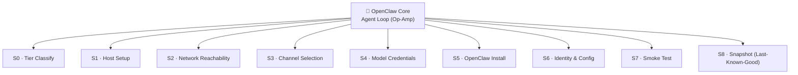

# Setup Atlas — OpenClaw Field Kit v0

```mermaid
flowchart TD
    Core["🦞 OpenClaw Core<br/>Agent Loop (Op-Amp)"] 
    Core --> S0["S0 · Tier Classify"]
    Core --> S1["S1 · Host Setup"]
    Core --> S2["S2 · Network Reachability"]
    Core --> S3["S3 · Channel Selection"]
    Core --> S4["S4 · Model Credentials"]
    Core --> S5["S5 · OpenClaw Install"]
    Core --> S6["S6 · Identity & Config"]
    Core --> S7["S7 · Smoke Test"]
    Core --> S8["S8 · Snapshot (Last-Known-Good)"]
```

**The full visual blueprint is in the hero image above.**
